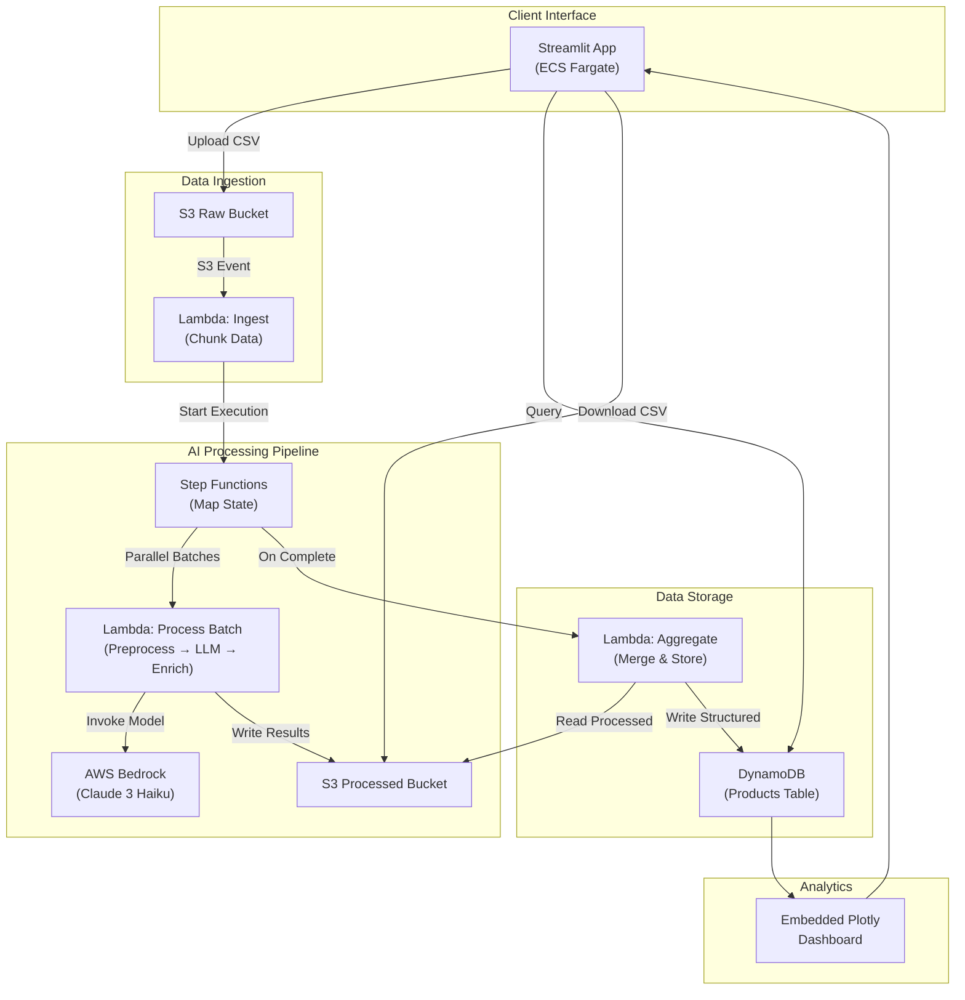

# AI-Driven Product Data Management & Classification — Implementation Plan

## Summary

Build a portfolio-grade, end-to-end AI pipeline that transforms messy, bilingual (Arabic + English) product data into clean, categorized, searchable datasets — deployed entirely on AWS with a Streamlit client interface.

---

## Decisions Summary (from Interview)

| Decision | Choice |
|---|---|
| **Project Stage** | Portfolio/demo first, then client acquisition |
| **Product Vertical** | Mixed e-commerce (clothing, electronics, accessories) |
| **Languages** | Bilingual Arabic + English |
| **Demo Dataset Size** | ~1,000–2,000 rows |
| **Data Source** | Synthetic messy dataset (controlled before/after) |
| **Output Schema** | Product Name, Category (L1), Sub-Category (L2), Sub-Sub-Category (L3), Brand, Color, Size, Gender, Material, Price, Tags/Keywords |
| **AI Engine** | LLM via AWS Bedrock — Claude 3 Haiku (few-shot prompting) |
| **Agentic Enrichment** | Yes — agent infers missing fields via reasoning + web search |
| **Web Scraping** | Basic demo scraper included |
| **IaC** | AWS CDK (Python) |
| **Database** | DynamoDB (serverless, pay-per-request) |
| **Analytics** | Embedded in Streamlit (Plotly/Altair charts) |
| **Export Formats** | CSV (universal) |
| **Python Version** | 3.11 or 3.12 |
| **Client Interface** | Streamlit |
| **App Hosting** | AWS EC2/ECS |
| **Concurrency** | Batch 10–20 rows per Lambda, orchestrated by Step Functions |
| **Repo Structure** | Monorepo with clear directory separation |
| **AWS Region** | us-east-1 |
| **Testing** | Unit tests (preprocessing) + integration tests (Bedrock calls) |
| **Version Control** | GitHub with polished README + architecture diagram |
| **Build Order** | Core pipeline first → AWS deployment → Streamlit app |

---

## Prerequisites (Before Development)

> [!IMPORTANT]
> Complete these before any code is written.

1. **Enable AWS Bedrock Model Access**
   - Go to AWS Console → Bedrock → Model Access → Request access to **Anthropic Claude 3 Haiku** in `us-east-1`
   - Approval is usually instant but can take up to 24 hours

2. **Install AWS CDK CLI**
   - `npm install -g aws-cdk`
   - Verify: `cdk --version`

3. **Configure AWS CLI**
   - `aws configure` with credentials for `us-east-1`
   - Ensure IAM user/role has permissions for: S3, Lambda, DynamoDB, Step Functions, Bedrock, EC2/ECS, CloudWatch

4. **Python Environment**
   - Python 3.11+ installed
   - `pip install uv` (fast package manager)

---

## Proposed Changes

### Repository Structure

```
AI-Driven Product Data Management & Classification/
├── README.md                          # Polished README with architecture diagram
├── pyproject.toml                     # Root project config
├── .gitignore
│
├── data/                              # Sample datasets
│   ├── raw/                           # Messy input data
│   │   └── sample_products_raw.csv
│   ├── taxonomy/                      # Category trees
│   │   └── taxonomy.json
│   └── output/                        # Cleaned output (gitignored)
│
├── pipeline/                          # Core AI/NLP pipeline
│   ├── __init__.py
│   ├── preprocessor.py                # Data cleaning (Pandas)
│   ├── llm_classifier.py             # Bedrock Claude 3 Haiku integration
│   ├── agentic_enricher.py           # AI Agent for missing field inference
│   ├── scraper.py                     # Basic web scraper module
│   ├── taxonomy.py                    # Taxonomy loading and validation
│   ├── schema.py                      # Output schema definitions (Pydantic)
│   ├── config.py                      # Pipeline configuration
│   └── utils.py                       # Shared utilities
│
├── lambda_functions/                  # AWS Lambda handlers
│   ├── ingest/                        # S3 trigger → chunk data
│   │   ├── handler.py
│   │   └── requirements.txt
│   ├── process_batch/                 # Process batch of rows via Bedrock
│   │   ├── handler.py
│   │   └── requirements.txt
│   └── aggregate/                     # Merge results → DynamoDB
│       ├── handler.py
│       └── requirements.txt
│
├── infrastructure/                    # AWS CDK (Python)
│   ├── app.py                         # CDK app entry point
│   ├── cdk.json
│   ├── requirements.txt
│   └── stacks/
│       ├── __init__.py
│       ├── storage_stack.py           # S3 + DynamoDB
│       ├── pipeline_stack.py          # Lambda + Step Functions
│       └── app_stack.py               # EC2/ECS for Streamlit
│
├── app/                               # Streamlit client application
│   ├── streamlit_app.py               # Main Streamlit app
│   ├── pages/
│   │   ├── 01_upload.py               # File upload page
│   │   ├── 02_processing.py           # Processing status page
│   │   ├── 03_results.py              # Results viewer + export
│   │   └── 04_analytics.py            # Embedded dashboard
│   ├── components/                    # Reusable UI components
│   │   ├── data_preview.py
│   │   ├── charts.py
│   │   └── export.py
│   ├── Dockerfile                     # For ECS deployment
│   └── requirements.txt
│
└── tests/                             # Automated tests
    ├── __init__.py
    ├── test_preprocessor.py           # Unit tests for data cleaning
    ├── test_taxonomy.py               # Unit tests for taxonomy logic
    ├── test_schema.py                 # Unit tests for schema validation
    ├── test_llm_classifier.py         # Integration tests for Bedrock
    └── conftest.py                    # Pytest fixtures
```

---

### Component 1: Synthetic Demo Dataset

#### [NEW] [sample_products_raw.csv](file:///d:/AI%20Projects/AI-Driven%20Product%20Data%20Management%20&%20Classification/data/raw/sample_products_raw.csv)
- Generate ~1,500 rows of intentionally messy product data
- Mix of Arabic and English titles in a single column
- Intentional issues: concatenated attributes (`"قميص رجالي أزرق قطن مقاس L"`), missing fields, inconsistent encoding, HTML entities, duplicate spaces, mixed-case brands
- Verticals: clothing (~50%), electronics (~30%), accessories (~20%)

#### [NEW] [taxonomy.json](file:///d:/AI%20Projects/AI-Driven%20Product%20Data%20Management%20&%20Classification/data/taxonomy/taxonomy.json)
- 3-level category tree covering the demo verticals
- Example: `Clothing > Men's > T-Shirts`, `Electronics > Smartphones > Cases`, `Accessories > Watches > Smart Watches`
- ~50–70 leaf categories

---

### Component 2: Core Pipeline (`/pipeline`)

#### [NEW] [preprocessor.py](file:///d:/AI%20Projects/AI-Driven%20Product%20Data%20Management%20&%20Classification/pipeline/preprocessor.py)
- **Data cleaning functions:** strip HTML, fix Arabic encoding (UTF-8 normalization), remove duplicate whitespace, standardize Arabic diacritics
- **Language detection:** Identify if each row is Arabic, English, or mixed
- **Deduplication:** Flag near-duplicate product titles using fuzzy matching
- Input: raw CSV/Excel → Output: cleaned DataFrame

#### [NEW] [llm_classifier.py](file:///d:/AI%20Projects/AI-Driven%20Product%20Data%20Management%20&%20Classification/pipeline/llm_classifier.py)
- **Bedrock client wrapper:** boto3 → `bedrock-runtime` → `invoke_model` with Claude 3 Haiku
- **Few-shot prompt template:** 5–10 examples of "messy title → structured JSON" for both Arabic and English
- **Batch processing:** Accept list of titles, send to Bedrock, parse JSON responses
- **Schema enforcement:** Validate LLM output against Pydantic model; retry on malformed responses
- **Confidence scoring:** Ask the LLM to return a confidence score (0–1) for each extracted field
- **Cost tracking:** Log token usage per request for cost monitoring

#### [NEW] [agentic_enricher.py](file:///d:/AI%20Projects/AI-Driven%20Product%20Data%20Management%20&%20Classification/pipeline/agentic_enricher.py)
- **Missing field detection:** Scan structured output for empty/null fields
- **Inference agent:** If brand is missing, use the product title + category to infer the brand via a follow-up LLM call with chain-of-thought reasoning
- **Web search fallback:** For products that can't be enriched via reasoning, use a web search API (e.g., SerpAPI or a simple requests-based Google search) to find the product and extract missing attributes
- **Audit trail:** Log every enrichment action (source: "inferred" vs. "web_search" vs. "original")

#### [NEW] [scraper.py](file:///d:/AI%20Projects/AI-Driven%20Product%20Data%20Management%20&%20Classification/pipeline/scraper.py)
- **Basic demo scraper:** BeautifulSoup + requests
- **Target:** A public product listing page (e.g., a sample product category from a public e-commerce site)
- **Output:** Extracted product titles fed into the preprocessing pipeline
- **Rate limiting:** Respectful crawling with delays

#### [NEW] [schema.py](file:///d:/AI%20Projects/AI-Driven%20Product%20Data%20Management%20&%20Classification/pipeline/schema.py)
- **Pydantic models:** `ProductRaw`, `ProductStructured`, `ProcessingResult`
- **Field validators:** Ensure category matches taxonomy, color is from allowed list, etc.
- **Serialization:** to/from JSON and CSV

#### [NEW] [taxonomy.py](file:///d:/AI%20Projects/AI-Driven%20Product%20Data%20Management%20&%20Classification/pipeline/taxonomy.py)
- Load taxonomy from JSON
- Validate that LLM-assigned categories exist in the taxonomy tree
- Fuzzy matching for close-but-not-exact category assignments

---

### Component 3: AWS Lambda Functions (`/lambda_functions`)

#### [NEW] Ingest Lambda (`ingest/handler.py`)
- **Trigger:** S3 `PutObject` event on the raw data bucket
- **Logic:** Read the uploaded CSV, split into chunks of 10–20 rows, push each chunk to an SQS queue or directly invoke Step Functions with a Map state
- **Output:** Step Functions execution started

#### [NEW] Process Batch Lambda (`process_batch/handler.py`)
- **Input:** A chunk of 10–20 raw product rows
- **Logic:** Run preprocessor → LLM classifier → agentic enricher on the batch
- **Output:** Structured product data (JSON) written back to S3 (processed/ prefix)
- **Timeout:** 5 minutes (generous for Bedrock latency)

#### [NEW] Aggregate Lambda (`aggregate/handler.py`)
- **Trigger:** Step Functions completion
- **Logic:** Read all processed chunks from S3, merge into final dataset, write to DynamoDB + export CSV to S3
- **Output:** DynamoDB populated, CSV in S3 output bucket

---

### Component 4: AWS CDK Infrastructure (`/infrastructure`)

#### [NEW] [storage_stack.py](file:///d:/AI%20Projects/AI-Driven%20Product%20Data%20Management%20&%20Classification/infrastructure/stacks/storage_stack.py)
- **S3 Buckets:** `raw-data-bucket`, `processed-data-bucket`
- **DynamoDB Table:** `products-table` with partition key `product_id`, GSI on `category`
- **Lifecycle rules:** Auto-delete raw data after 30 days

#### [NEW] [pipeline_stack.py](file:///d:/AI%20Projects/AI-Driven%20Product%20Data%20Management%20&%20Classification/infrastructure/stacks/pipeline_stack.py)
- **Lambda Functions:** 3 functions with appropriate IAM roles (S3 read/write, Bedrock invoke, DynamoDB write)
- **Step Functions State Machine:** Map state for parallel batch processing with error handling and retries
- **S3 Event Notification:** Trigger ingest Lambda on upload
- **CloudWatch Alarms:** Alert on Lambda errors or Bedrock throttling

#### [NEW] [app_stack.py](file:///d:/AI%20Projects/AI-Driven%20Product%20Data%20Management%20&%20Classification/infrastructure/stacks/app_stack.py)
- **ECS Fargate Service:** Run Streamlit in a Docker container
- **Application Load Balancer:** Public-facing HTTPS endpoint
- **ECR Repository:** Store the Streamlit Docker image
- **Security Group:** Allow inbound HTTP/HTTPS only

---

### Component 5: Streamlit Application (`/app`)

#### [NEW] [streamlit_app.py](file:///d:/AI%20Projects/AI-Driven%20Product%20Data%20Management%20&%20Classification/app/streamlit_app.py)
- Main app entry point with multi-page navigation
- Branding, dark theme, professional styling

#### [NEW] Upload Page (`pages/01_upload.py`)
- Drag-and-drop file upload (CSV, Excel, JSON)
- Data preview table (first 10 rows)
- Schema/taxonomy selection
- "Start Processing" button → uploads to S3 → triggers pipeline

#### [NEW] Processing Page (`pages/02_processing.py`)
- Real-time progress tracking (poll Step Functions execution status)
- Show batch completion percentage
- Estimated time remaining

#### [NEW] Results Page (`pages/03_results.py`)
- Full structured data table with search and filters
- Side-by-side before/after comparison
- Confidence score highlighting (low-confidence fields flagged in amber/red)
- CSV download button

#### [NEW] Analytics Page (`pages/04_analytics.py`)
- **Category Distribution:** Plotly treemap/sunburst chart
- **Data Quality Score:** Gauge chart showing % of fields filled
- **Brand Analysis:** Horizontal bar chart of top 15 brands
- **Language Distribution:** Pie chart (Arabic vs. English vs. Mixed)
- **Confidence Distribution:** Histogram of LLM confidence scores

---

### Component 6: Tests (`/tests`)

#### [NEW] [test_preprocessor.py](file:///d:/AI%20Projects/AI-Driven%20Product%20Data%20Management%20&%20Classification/tests/test_preprocessor.py)
- Test HTML stripping, encoding fix, whitespace normalization
- Test Arabic diacritic handling
- Test language detection accuracy
- Test deduplication logic

#### [NEW] [test_llm_classifier.py](file:///d:/AI%20Projects/AI-Driven%20Product%20Data%20Management%20&%20Classification/tests/test_llm_classifier.py)
- Integration test: send 5 sample titles to Bedrock, verify structured JSON output
- Test prompt template rendering
- Test retry logic on malformed responses
- Test schema validation of LLM output

---

### Component 7: Documentation

#### [NEW] [README.md](file:///d:/AI%20Projects/AI-Driven%20Product%20Data%20Management%20&%20Classification/README.md)
- Project overview and problem statement
- Architecture diagram (Mermaid)
- Tech stack badges
- Setup instructions (prerequisites, CDK deploy)
- Demo screenshots
- Cost estimation
- Future enhancements

---

## Architecture Diagram



---

## Build Order (Phased Execution)

### Sprint 1 (Week 1): Core Pipeline — Local Development
1. Set up repository structure, pyproject.toml, .gitignore
2. Generate synthetic demo dataset (`sample_products_raw.csv`)
3. Define taxonomy tree (`taxonomy.json`)
4. Build `preprocessor.py` — data cleaning functions
5. Build `schema.py` — Pydantic models
6. Build `taxonomy.py` — taxonomy loading/validation
7. Build `llm_classifier.py` — Bedrock integration with few-shot prompts
8. Build `agentic_enricher.py` — missing field inference
9. Write unit tests and run locally
10. **Milestone:** Run pipeline locally on full demo dataset, verify output quality

### Sprint 2 (Week 2): AWS Infrastructure
1. Build CDK stacks (storage, pipeline, app)
2. Write Lambda function handlers
3. Deploy infrastructure with `cdk deploy`
4. Test end-to-end: upload to S3 → Lambda → Step Functions → DynamoDB
5. Build basic web scraper demo module
6. **Milestone:** Pipeline runs fully on AWS, triggered by S3 upload

### Sprint 3 (Week 3): Streamlit App + Polish
1. Build Streamlit app with all 4 pages
2. Connect app to S3/DynamoDB for real-time data
3. Build embedded analytics dashboard (Plotly)
4. Dockerize Streamlit app
5. Deploy to ECS via CDK
6. Write README with architecture diagram, screenshots
7. Integration tests against deployed infrastructure
8. **Milestone:** Full working demo accessible via public URL

---

## Verification Plan

### Automated Tests
```bash
# Unit tests (local)
pytest tests/test_preprocessor.py tests/test_taxonomy.py tests/test_schema.py -v

# Integration tests (requires AWS credentials)
pytest tests/test_llm_classifier.py -v --integration

# CDK synthesis (verify infrastructure compiles)
cd infrastructure && cdk synth
```

### Manual Verification
- Upload the demo CSV through the Streamlit app
- Verify all 1,500 rows are processed correctly
- Check DynamoDB for structured data completeness
- Review analytics dashboard for accurate metrics
- Download exported CSV and verify format
- Test with Arabic-only, English-only, and mixed inputs
- Verify agentic enrichment fills at least 90% of missing fields

### Cost Verification
- Monitor AWS Cost Explorer after running the full pipeline
- Target: < $5 total for processing 1,500 rows through Haiku

---

## Open Questions

> [!IMPORTANT]
> **Web Scraper Target Site:** Which public e-commerce site should the demo scraper target? Options: a generic product listing page, or a specific MENA site. We need to choose a site with simple HTML structure and no aggressive anti-bot measures.

> [!IMPORTANT]
> **Agentic Web Search API:** For the agentic enricher's web search fallback, which API should we use? Options: SerpAPI (paid, reliable), a free Google search workaround, or DuckDuckGo's informal API. SerpAPI is most reliable but requires an API key and has costs.

> [!NOTE]
> **ECS vs. EC2 for Streamlit:** You selected EC2/ECS. I recommend **ECS Fargate** specifically — it's serverless containers, no server management needed, and integrates cleanly with CDK. Is that acceptable, or do you specifically want a raw EC2 instance?
